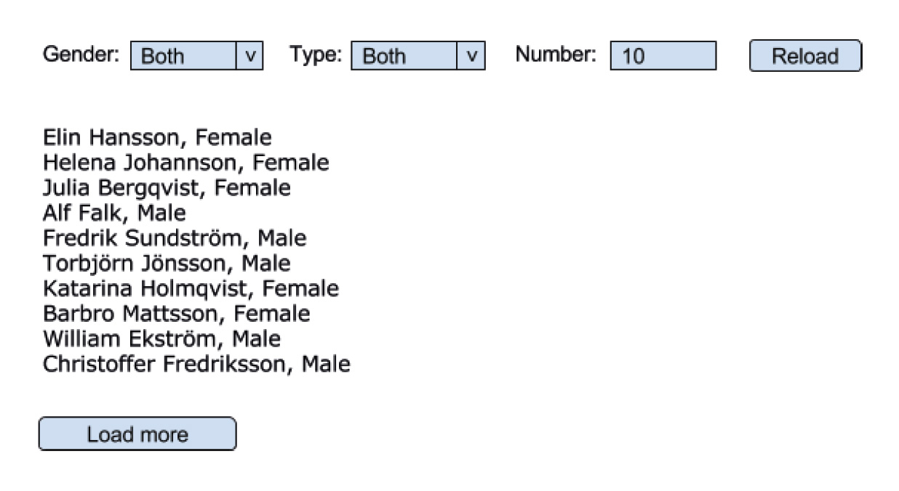

# 4) JSFE API | download and send data to a server

path: <https://github.com/Lars-S-Berg/js-fe-exercises/tree/main/4-api-show-send>

The purpose with the exercise is to understand JSON, fetch data from a server and show it on a webpage, and to practice  the posibility to send data (<https://jsonplaceholder.typicode.com/>).

## Purpose/course objectives

1. Be able to apply techniques to retrieve and send data to the server
2. Be able to apply technology to manage data in the browser
3. "Be able to explain how a user communicates with the server".

Key concepts

- JSON
- Callbacks
- Promise
- async/await
- LocalStorage
- Cookies
- FormData
- Otional: AJAX: fetch()

## Exercise description

This exercise involves slightly different exercises within several techniques. This is quite a large task, which you choose yourself to what degree you want to investigate

The task requires that you have two separate html pages, with a simple menu. So you can save data between the pages.

Now go to <https://namnapi.se/> and get into its api. Use Postman to see how it's structured. Notice that you choose yourself in the url how many names you want. Granted, the examples aren't with JavaScript, but that doesn't matter since you're using fetch().

Create some objects suitably named with simple names, such as Pelle and Stina. Create appropriate functions to save the objects in the browser, using localStorage. Now create one or more cookies. Let the user (Pelle/Stina) state their name (prompt or form). The idea is that the user should then go to page 2, and there see a greeting with their name, as well as the content of the object that bears the user's name.

Now, look at the exercise wireframe. Try doing something similar. If not having all the niceties in place when you're done is of minor importance, do the best you can. Work methodically, start by making room on the website where the list of names can be displayed.

Optional: Use AJAX technology to update only a part of the loaded webpage, without the need to update the rest of the content. If you follow the attached wireframe, it could mean that only the list of names is updated, without the rest of the page being reloaded when the user clicks on "Reload" or "Load more".

## Additional general instructions

1. It is recommended to work in project form as a group.

2. The repo is recommended to include, in addition to all other files
    - a README.md, where the website/project is described
    - a github projekt, where every team-memeber can contribute and follow the progress
