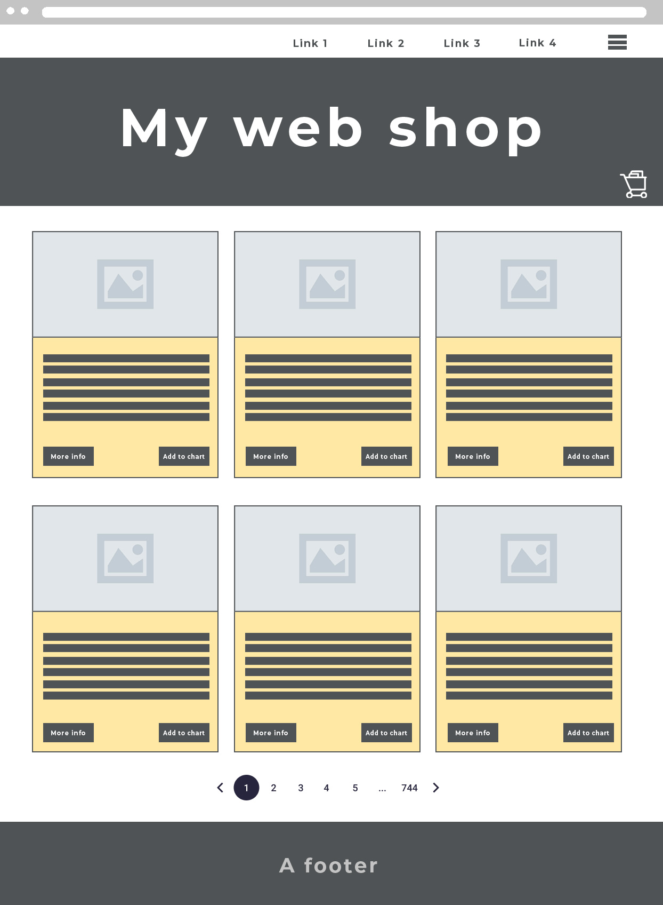
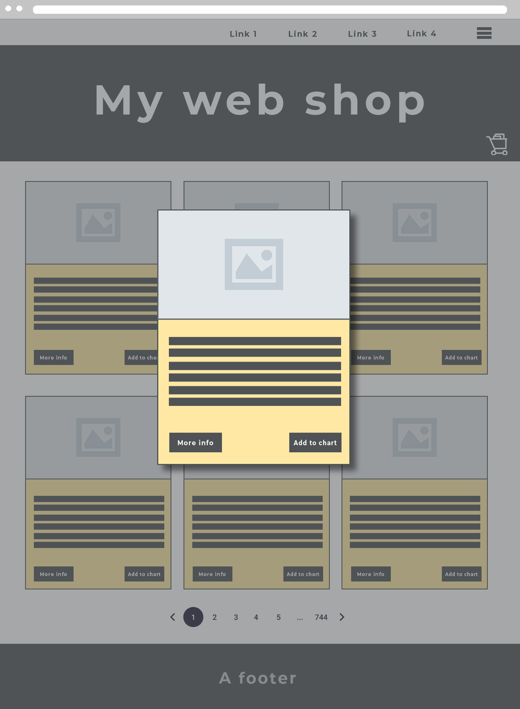
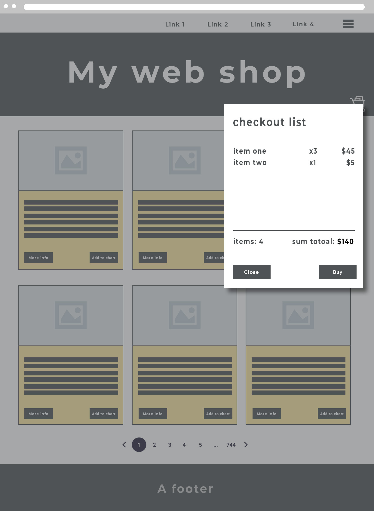

# JSFE | course submission

path: <https://github.com/Lars-S-Berg/js-fe-exercises/tree/main/5-course-submision>

## Course submission

An examining/grading submission for the course JavaScript Frontend. Program Webbutvecklare inom .NET.

EC Utbildning, Halmstad and Göteborg.

### Purpose/course objectives

"Be able to independently produce interactive web applications with JavaScript in a secure manner and according to good programming practice".

Which includes:

1. Introduction and deepening within JavaScript
2. Troubleshooting and error handling
3. Change web page content dynamically
4. Handle events from the user
5. Download and send data to the server
6. Manage data in the browser
7. Continuous versioning with Git
8. Cleaned code (unified, formatted, restructured)
9. Code free of obvious bugs
10. Tests have been used where appropriate

## Task description - A frontend app

The objective of the submission is, from an optional open api, to create a foundation for a dynamically controlled web page; similar to a web shop.

The application should display "products" in a gallery, taken from at selected api. The "web shop" does not necessarily have to sell anything, but the user should be able to add products to a shopping cart or a todo-list, from which the user can see the added items, the number, possibly the price, etc, as well as add and remove content from the shopping cart. Optional: the shopping cart should remain even if the page is refreshed.

The user shall be able to trigger more web-api calls, to fill the page with more content from the api than what is showed at first visit. The page should not have to be reloaded, and
should preferably not be navigated to a new page either.

At the end, there are som exampel of wireframes to help plan the site/task. Lastly: use fetch(), *not* XMLHttpRequest().

### Examples of API to be used

1. [SMHI](https://opendata.smhi.se/apidocs/)
2. [SR](https://sverigesradio.se/artikel/dokumentation-for-api-version-2) (byggt med xml, 2022-09-24)
3. [Pokémon Api](https://pokeapi.co/)
4. [Punk API](https://punkapi.com/) (BrewDog beers)
5. [Google Earth](https://developers.google.com/earth-engine/#api)

It is *your responsibility* to read and understand the API descriptions. Do not choose a API that feels to complicated.

## Workflow

The submission is individual, but it is recommended to work in project form as a group. Regardless of the form of work, the work must be documented and version managed via Github (don't forget to invite teachers in good time). When working in groups, you must pay attention so that approximately the same number of individual commits take place. Regardless of the way you work, you need to be able to show your own commits with how you make api calls and how you use incoming information to display and save dynamic content to website visitors.

Bootstrap is advantageously used for the interface (this is *not* a course where your knowledge of html/css is assessed), and it is allowed to take inspiration from others such as from [CSShint](https://csshint.com/bootstrap-shoping-carts/).

When working in groups, it is important that all team members individually code at least one element to fulfill the requirement in the task description. One person can for instance make a [Bootstrap Collapse](https://getbootstrap.com/docs/5.2/components/collapse/) or a [Bootstrap Modal](https://getbootstrap.com/docs/5.2/components/modal/) that shows more info about an object when you click read more/read comments, while the others can do a [Pagination](https://getbootstrap.com/docs/5.2/components/pagination/) or let a secondary navigation (not the main navigation, which is usually reserved for the site's architecture) be use to see a certain amount of articles at a time and to scroll back and forth.

### Can we do something else?

It is  permitted to do something other than the proposed webshop. However, it is then up to the individual/group to carry out the project and ensure that the course's objectives are carried out. The most important thing is to use an api, with fetch() and to build a dynamically structured web page that keeps the page updated.

> The entire task must be handing in at Omniway, by compressing the root folder (zip/rar). Note that all members of a group each must submit their own copy of the project! Also, any written tasks (except logbook and readme) and submission questions that belong to the task are answered in Omniway.

## Wireframes

The following wireframes are only suggestions to get you started on the task. Following them is optional.

### Start

### A closer look at a card

### Checkout

